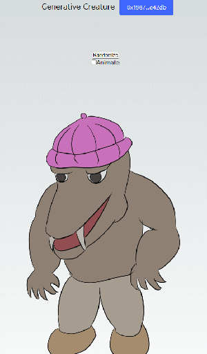

# Proc-creature

This is a project that attempts to create a procedural creature with its feature genes stored in a blockchain.

## The logic

The creature has 3 features, each of which has 3 variants.
The features are stored in a key in blockchain NFT.
The goal of the project is to make a trading game market to exchange the genes and get the owner's desired feature set by intermixing.

Currently, it works on devnet.

## Files

* `index.html` - a standalone demo of the logic. It has random button to test appearances of random combinations of genes.
* `move` - a folder that contains the smart contract in Move language.
* `nextjs` - a folder containing Next.js project that actually uses blockchain to store the genes.
* `assets` - a folder containing common image assets.
* `scripts` - a folder with utility scripts, such as creating account, minting and transferring.
